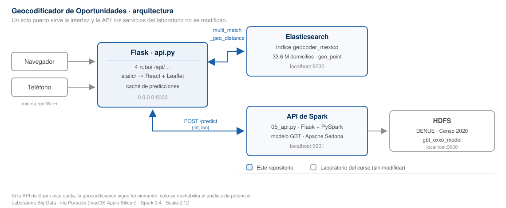

# Geocodificador de Oportunidades · México

**Proyecto final del módulo de Aprendizaje Automático para Grandes Volúmenes de
Datos** · Maestría en Inteligencia Artificial y Ciencia de Datos · Universidad
Panamericana, Campus Aguascalientes.

Busca cualquiera de los 33.6 millones de domicilios de México en un mapa, y
estima con un modelo de aprendizaje automático si una ubicación tiene más
potencial para una tienda de conveniencia o para una tienda de abarrotes.

Funciona por completo en tu computadora: no envía nada a internet.

---

## Precondición · el laboratorio del curso

Esta aplicación **no funciona por sí sola.** Es un cliente del laboratorio de Big
Data del **Dr. Abel Coronado**, y necesita sus servicios ya corriendo: Elasticsearch
con el índice de domicilios, la API de inferencia y HDFS.

Si todavía no lo tienes instalado, el punto de entrada es el **BDP Meta-Launcher**:

**<https://github.com/abxda/bdp-meta-launcher>**

Diagnostica el sistema operativo y la arquitectura, descarga la distribución que
corresponda, verifica su integridad y la lanza:

| Sistema | Arquitectura | Distribución |
|---|---|---|
| Windows | x86-64 | Portable o Vagrant, a elegir |
| Linux | x86-64 | Vagrant |
| macOS | Intel | Vagrant |
| macOS | Apple Silicon | Portable |

**Las rutas de este README —`~/bdp/portable/…`— son las de la vía Portable**, que
es la que corresponde a un Mac con Apple Silicon. Si instalaste por Vagrant, los
servicios viven dentro de la máquina virtual y tanto las rutas como los puertos
cambian.

---

## Cómo está organizado



```
backend/     Python + Flask · consulta Elasticsearch y llama al modelo
frontend/    React + Leaflet · el mapa y la interfaz
docs/        plan de implementación y diagrama de arquitectura
tests/       lanzador de toda la batería de pruebas
```

El backend expone cuatro rutas y el frontend las consume. El frontend se compila
a `backend/static/` y Flask lo sirve, así que **todo corre en un solo puerto**.

| Ruta | Qué hace |
|---|---|
| `GET /api/health` | Estado de Elasticsearch y de la API de Spark |
| `GET /api/geocode?q=…` | Dirección en texto libre → coordenadas |
| `GET /api/reverse?lat=…&lon=…` | Coordenadas → direcciones más cercanas |
| `POST /api/predict` | Coordenadas → potencial de negocio |

[Demo](https://youtu.be/SUpSFx_m6Fw?si=BaQHid0W_AHbf71F)

---

## Cómo levantarlo

Este backend usa su **propio entorno virtual**, aislado del laboratorio. Solo
necesita cuatro paquetes (`flask`, `flask-cors`, `elasticsearch`, `requests`):
no toca Spark, se comunica con él por HTTP. Así, instalar dependencias aquí no
puede romper los cuadernos del curso.

### Una sola vez

Instala Node 20 LTS (Long Term Support, la versión con soporte prolongado)
desde <https://nodejs.org> — no viene con el laboratorio.
Después:

```bash
cd ~/dev/geocodificador-oportunidades-mx

# Entorno virtual, usando el Python 3.10 del laboratorio como base
~/bdp/portable/python/bin/python3 -m venv .venv
.venv/bin/python3 -m pip install -r backend/requirements.txt

# Frontend
cd frontend && npm install && npm run build
```

El `build` deja el frontend compilado dentro de `backend/static/`.

> No hace falta «activar» nada: todos los comandos llaman a
> `.venv/bin/python3` por su ruta, así no hay estado que recordar.

### Cada vez

1. Abre **Big Data Lab** → **Servicios** → **Iniciar TODO**, y espera a que todos
   digan **Sano**.
2. *(Opcional, para el análisis de negocio)* levanta la API de Spark. **Esta sí
   usa el Python del laboratorio**, porque necesita PySpark y Sedona:

   ```bash
   cd ~/bdp/portable/notebooks
   JAVA_HOME=~/bdp/portable/common_jdk/zulu-11.jdk/Contents/Home ~/bdp/portable/python/bin/python3 05_api.py
   ```

3. Arranca la aplicación:

   ```bash
   cd ~/dev/geocodificador-oportunidades-mx
   .venv/bin/python3 backend/api.py
   ```

Abre <http://localhost:8000>.

### Qué intérprete usa cada cosa

| Proceso | Intérprete | Por qué |
|---|---|---|
| `backend/api.py` | `.venv/bin/python3` | Solo necesita Flask y el cliente de Elasticsearch |
| Pruebas | `.venv/bin/python3` | Las mismas dependencias |
| `05_api.py` *(del laboratorio)* | `~/bdp/portable/python/bin/python3` | Necesita PySpark, Sedona y el JDK (Java Development Kit) |

### Desde el teléfono

Al arrancar, `api.py` lista **todas** las direcciones de la máquina:

```
En esta computadora : http://localhost:8000

Desde el teléfono, prueba:
    http://192.168.100.27:8000   ← por ejemplo
```

**Si aparece más de una, no basta con usar la marcada.** Un Mac con Ethernet y
Wi-Fi a la vez, o con Compartir Internet activado, tiene varias redes y solo
una llega al teléfono.

**Cómo elegir la correcta:** mira la IP del teléfono en Ajustes → Wi-Fi → tu red.
Usa la del Mac que empiece por los **mismos tres números**. Si el teléfono tiene
`192.168.100.45`, la buena es `192.168.100.27`.

Escribe la dirección con **`http://` completo**. Sin él, tanto Chrome como
Safari o Samsung Internet lo interpretan como una búsqueda.

La primera vez, macOS preguntará si permite conexiones entrantes: acepta.

No hace falta configurar nada más. Como el frontend se sirve desde el mismo
puerto que la API, las llamadas van al mismo origen y funcionan con cualquier
dirección.

#### Si el teléfono no carga nada

**Primero, aísla el problema.** Abre en el teléfono:

```
http://LA_IP:8000/api/health
```

Si responde con texto JSON, la red va bien y el fallo está en la aplicación.
Si no carga, es red o firewall, y sigue leyendo.

**Comprueba que el servidor escucha en toda la red.** En el Mac:

```bash
lsof -nP -iTCP:8000 -sTCP:LISTEN
```

Debe decir `TCP *:8000`. Si dice `127.0.0.1:8000`, solo acepta conexiones
locales y el teléfono nunca entrará.

**En Android, y sobre todo en Samsung**, hay tres ajustes que rompen justo esto:

| Ajuste | Dónde | Por qué falla |
|---|---|---|
| **Wi-Fi seguro** | Ajustes → Conexiones → Wi-Fi → ⋮ | Es una VPN: enruta todo fuera y tu red local deja de existir |
| **Cambio a datos móviles** | Wi-Fi → Avanzado | Si cree que la Wi-Fi va mal, se pasa a la red celular sin avisar |
| **DNS privado** | Conexiones → Más → DNS privado | Puede impedir resolver direcciones locales |

**Comprueba el firewall del Mac:**

```bash
/usr/libexec/ApplicationFirewall/socketfilterfw --getglobalstate
```

Si está activo, dale permiso de conexiones entrantes al `python3` del entorno
virtual, o desactívalo un momento para confirmar que es eso.

**Red de invitados.** Si el teléfono está en la Wi-Fi de invitados del router,
puede tener aislamiento de clientes activado y no verá nada del Mac aunque las
IP parezcan compatibles.

### Para desarrollar

Con dos servidores, los cambios del frontend se recargan al instante:

```bash
cd frontend && cp .env.example .env.local   # una vez
npm run dev                                  # puerto 5173
```

En otra terminal, el backend como arriba. Aquí sí hace falta `VITE_API_BASE`,
porque son dos orígenes distintos.

---

### Si algo falla

**`ModuleNotFoundError: No module named 'flask'`.** Estás usando `python3` a
secas en vez del entorno virtual. Los comandos empiezan con `.venv/bin/python3`
justamente por eso. Si el entorno aún no existe, créalo con el bloque de «Una
sola vez».

**`ModuleNotFoundError: No module named 'pyspark'` al arrancar `05_api.py`.**
Ese script necesita el Python del laboratorio, no el entorno virtual de este
repositorio. Ver la tabla de intérpretes.

**`JAVA_HOME is not set` o `Java gateway process exited`.** Le falta el prefijo
`JAVA_HOME=…` al comando de `05_api.py`. Pega el bloque completo, las dos
líneas. El `entorno_cli.sh` del laboratorio define mal esa variable en macOS:
el JDK está en `common_jdk/zulu-11.jdk/Contents/Home`.

**La raíz devuelve 503 diciendo que falta compilar.** Ejecuta `npm run build`
dentro de `frontend/`. Las rutas `/api/…` funcionan igual mientras tanto.

---

## Qué necesita para funcionar

Esta aplicación no reemplaza al laboratorio de Big Data del curso: lo usa. Si aún
no lo tienes levantado, ver [Precondición](#precondición--el-laboratorio-del-curso).

| Servicio | Puerto | Para qué |
|---|---|---|
| Elasticsearch | 9200 | Buscar direcciones en el índice `geocoder_mexico` |
| API de Spark (`05_api.py`) | 5001 | Predecir el potencial de negocio |
| HDFS (Hadoop Distributed File System) | 9000 | De donde la API lee el modelo y los datos |

Si la API de Spark no está activa, **la búsqueda de direcciones sigue
funcionando**: solo se deshabilita el botón de análisis. La barra superior
muestra el estado de ambos servicios.

El índice se puebla una sola vez con los cuadernos `01_ProcesarDirecciones` y
`02_IndexacionGeoespacial` del laboratorio.

**Los datos no están en este repositorio.** El parquet de domicilios pesa
886 MB y los del DENUE (Directorio Estadístico Nacional de Unidades Económicas)
y el Censo suman más de 2 GB; se regeneran con esos
cuadernos.

## Relación con la versión 1

Existe una primera versión construida con **Streamlit**, el framework recomendado
en el curso. **Esta versión 2 es la que se entrega**: separa el
backend del frontend, rediseña la interfaz y funciona desde el teléfono.

La versión 1 **permanece intacta** en el laboratorio, como referencia. Ambas
comparten los mismos servicios y pueden convivir.

## Pruebas

Corren **sin** Elasticsearch, HDFS ni Spark: Elasticsearch se simula y la API de
inferencia se sustituye por un servidor que reproduce sus modos de fallo
(HTTP 400 y 500, respuesta no-JSON, campos faltantes, expiración).

```bash
PY=.venv/bin/python3 bash tests/run_all.sh
```

Cinco suites:

| Suite | Qué comprueba |
|---|---|
| `test_scoring.py` | Umbrales en sus fronteras exactas y criterio de coordenada |
| `test_api.py` | Las cuatro rutas, sus códigos de error y la caché |
| `test_estaticos.py` | Que `/api/…` no lo absorba el servidor de archivos |
| `test_coherencia.mjs` | Que Python y JavaScript redondeen las coordenadas igual |
| `test_frontend.mjs` | Lógica, contraste de colores y `api.js` contra el backend real |

## Decisiones de diseño

**El color dice el potencial, el icono dice el tipo de tienda.** Son dos canales
independientes, así el mapa responde a la vez «¿hay oportunidad aquí?» y «¿de
qué tipo?». El nivel (alto / medio / bajo) lo calcula el backend, de modo que
los umbrales viven en un solo sitio.

**El análisis se dispara con un botón, no al seleccionar.** Cada predicción
ocupa Spark decenas de segundos recalculando features contra el DENUE y el
Censo nacional; lanzarla en cada clic haría la aplicación inservible.

**Tres cachés con el mismo criterio de coordenada.** Backend, cliente e
historial redondean a seis decimales (≈ 11 cm). Si discreparan, un punto podría
estar cacheado en un sitio y no en otro; hay una prueba que lo verifica
comparando ambos lenguajes sobre 5 000 coordenadas.

**Un fallo de la API nunca tumba la geocodificación.** Los códigos HTTP separan
la culpa: 400 si la petición está mal, 502 si falló la API de Spark, 503 si no
responde Elasticsearch.

## Créditos

Proyecto final del módulo de *Aprendizaje Automático para Grandes Volúmenes de
Datos*, de la Maestría en Inteligencia Artificial y Ciencia de Datos de la
Universidad Panamericana · Campus Aguascalientes.

Autor: **Manuel Alejandro Serrano Macías**. Profesor: **Dr. Abel Coronado**.

El laboratorio de Big Data, los cuadernos del curso y la API de inferencia
(`05_api.py`) son material del **Dr. Abel Coronado** y no forman parte de este
repositorio. Se distribuyen a través del **BDP Meta-Launcher**:
<https://github.com/abxda/bdp-meta-launcher>

Los datos del DENUE y del Censo de Población y Vivienda 2020 son del **INEGI**
(Instituto Nacional de Estadística y Geografía), publicados bajo sus términos
de libre uso.

## Licencia

MIT. Cubre únicamente el código de este repositorio.
